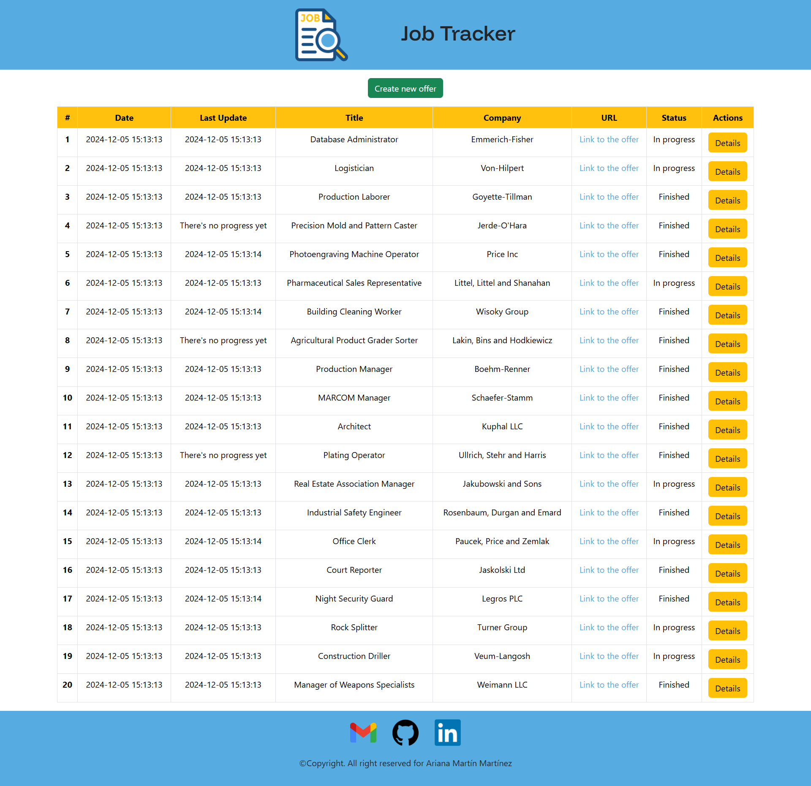
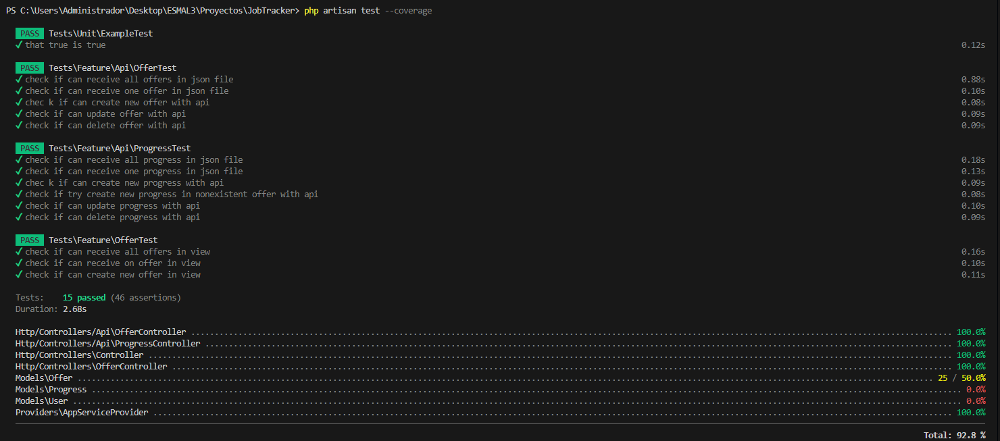

# Job Tracker 💼✅

>[!CAUTION]
>Please read all the points of the README in order to make good use of the project. Thank you.

## 💡 Description

This project consists of a website where you keep track of the offers to which you apply.

You can keep track of the offers as you can add comments to each of the offers; that is, if you are called for the first interview, you can add a comment indicating that.

The same applies for any type of progress you want to add.

## 💼 Proyect guide

On the home page there is a table with all the offers you have previously inserted (via API).

We can see the date when the offer was added, the job title, the company, a link that leads to the offer, if it is 'In progress' of 'Finished' and a button that leads to the detailed view.

We also have the date of the last update of the offers, which refers to the date of creation of the last comment that has been added to each one. If we don't have any comments for an offer, instead of the date it will show a message 'There's no progress yet'.

This way we can keep track of how long it has been since we have had an update on an offer.


<p align="center"><em>Home view</em></p>

On the page to see the details of an offer, in addition to seeing the data we already see on the home page, we can see the commentos of the offer. Seeing both the comment itself and the date on which it was created.


<p align="center"><em>Details view</em></p>

## ❓ Installation requierements

In order to run and try this project locally you will need:

1. XAMPP (or any other local server that supports PHP and MySQL)

2. Operating System terminal

3. Install Composer

4. Install NPM via Node.js

5. Xdebug (so you can see the tests coverage)

6. Postman (or any other platform to use the API, like *Insomnia*)

## 💻 Installation

1. Clone the repository:
```
    git clone https://github.com/ArianaMartinMartinez/JobTracker.git
```

2. Install Composer:
```
    composer install
```

3. Install NPM:
```
    npm install
```

4. Create a '.env' file by taking the example '.env.example' file and modify the lines:
    - DB_CONNECTION=mysql
    - DB_DATABASE=job_tracker

5. Create a database in MySQL with no tables (I use *phpMyAdmin*)


6. Generate all the tables and fake values:
```
    php artisan migrate:fresh --seed
```

7. Run NPM:
```
    npm run dev
```

8. Run Laravel (in other terminal):
```
    php artisan serve
```

This will generate an url that will lead you to the web similar to this one:
```
    http://127.0.0.1:8000/
```

## 📚 Database diagram

This is the database diagram for this project. We have two tables, **Offers** and **Progress**. Which have a ***OneToMany*** relation because in one offer we can have many progresses (comment) but one progress corresponds to just one offer.


## 🔍 API Endpoints

As there are two tables in the database, 5 endpoints have been created for each one to be able to manipulate the two tables.

### Offers

>[!NOTE]
>Offer fields: title, company, url, status (In progress or Finished).

- GET (read all offers)
```
    http://127.0.0.1:8000/api/offers
```

- GET BY ID (read one offer selected by ID with it's corresponding progresses)
```
    http://127.0.0.1:8000/api/offers/{id}
```

- POST (insert a new offer)
```
    http://127.0.0.1:8000/api/offers
```

- PUT (update an offer selected by ID)
```
    http://127.0.0.1:8000/api/offers/{id}
```

- DELETE (delete an offer selected by ID)
```
    http://127.0.0.1:8000/api/offers/{id}
```

### Progress

>[!NOTE]
>Progress fields: comment, id_offer.

- GET (read all progresses)
```
    http://127.0.0.1:8000/api/progresses
```

- GET BY ID (read one progress selected by ID)
```
    http://127.0.0.1:8000/api/progresses/{id}
```

- POST (create a new progress on a specific offer selected by ID. Don't need to write the id_offer and comment must be an array)
```
    http://127.0.0.1:8000/api/offers/{id}/progresses
```

- PUT (update a progress selected by ID)
```
    http://127.0.0.1:8000/api/progresses/{id}
```

- DELETE (delete a progress selected by ID)
```
    http://127.0.0.1:8000/api/progresses/{id}
```

## 👾 Tests

You can try the tests and see the coverage in the terminal using:
```
   php artisan test --coverage
```



>[!TIP]
>You can also see the coverage in a web browser using:
>```
>   php artisan test --coverage-html=coverage-report
>```

## 🛠️ Technologies and Tools

<a href='https://github.com/shivamkapasia0' target="_blank"></a>
<a href='https://github.com/shivamkapasia0' target="_blank"></a>
<a href='https://github.com/shivamkapasia0' target="_blank"></a>
<a href='https://github.com/shivamkapasia0' target="_blank"></a>
<a href='https://github.com/shivamkapasia0' target="_blank"></a>
<a href='https://github.com/shivamkapasia0' target="_blank"></a>

<a href='https://github.com/shivamkapasia0' target="_blank"></a>
<a href='https://github.com/shivamkapasia0' target="_blank"></a>
<a href='https://github.com/shivamkapasia0' target="_blank"></a>
<a href='https://github.com/shivamkapasia0' target="_blank"></a>
<a href='https://github.com/shivamkapasia0' target="_blank"></a>

## 👨🏻‍💻 Author

This project was fully developed by: 

[Ariana Martín Martínez](https://github.com/ArianaMartinMartinez)